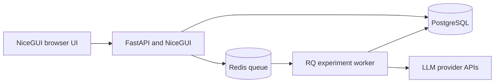

# EvalForge

**Multi Provider LLM Evaluation Platform**

EvalForge is a local first application for testing, comparing, and selecting language models with reproducible prompts, versioned datasets, deterministic evaluation, real provider APIs, cost tracking, latency metrics, regression checks, and exportable reports.

The application is written primarily in Python. It combines FastAPI, NiceGUI, SQLAlchemy, PostgreSQL, Redis, and RQ in a modular architecture intended for continued product development rather than a UI only prototype.

## Live demo

[](https://evalforge-imwj.onrender.com/)

The hosted portfolio instance runs in read only showcase mode. Registration, provider credentials, experiment execution, and data mutations are disabled, while the complete seeded demonstration remains available for exploration.

The landing page opens the safe demonstration with one click. Public credentials are not displayed or required.

The free hosting instance may need up to a minute to wake after a period without traffic.

## Highlights

* English and Polish interface selected inside the application
* Light and dark themes with a responsive SaaS layout
* Local accounts, Argon2 password hashing, signed sessions, workspaces, and Admin, Member, Viewer roles
* Encrypted provider credentials with connection testing and masked display
* Real adapters for OpenAI, Anthropic Claude, Google Gemini, Mistral AI, OpenRouter, and Ollama
* Provider model synchronization without deleting historical models
* Manual model registration and versioned pricing history
* Immutable prompt and dataset versions
* JSON and CSV dataset import and export
* Background experiments with bounded concurrency, retry, timeout, cancellation, progress, partial persistence, and budget limits
* Exact match, required keyword, JSON, and JSON Schema evaluators
* Extensible semantic similarity evaluator with injected embeddings
* Quality, cost, token, latency, error, and stability metrics
* Weighted model recommendation and baseline regression services
* Human reviews for individual model responses
* HTML, PDF, CSV, and JSON reports with checksums
* Structured audit records with recursive secret redaction
* Twenty case customer support demonstration dataset and an explicitly labelled demonstration report
* Read only public showcase mode for safe portfolio deployments
* Public landing page with bilingual Privacy Policy and Terms of Use
* Interactive simulated experiment with scenarios, editable prompts, deterministic model comparisons, case level answers, recommendations, charts, and a downloadable report
* One click demonstration access without an account, shared password, provider key, external API call, or persisted visitor input
* API request limiting and production security headers

## Screenshots

Run the application and open `http://localhost:8080`. The demonstration account opens on a populated dashboard. Screenshot assets can be added to `docs/images` without changing the documentation structure.

## Architecture



The detailed component model, entity relationship diagram, experiment sequence, cost calculation, security decisions, and architectural decisions are documented in [docs/architecture.md](docs/architecture.md).

## Repository structure

```text
app/
  api/routes/           FastAPI transport and authorization
  evaluators/           Deterministic and extensible evaluation methods
  models/               SQLAlchemy persistence entities
  providers/            One adapter per provider family
  schemas/              Pydantic request and response contracts
  services/             Business logic, security, metrics, and reports
  ui/pages/             NiceGUI pages
  workers/              RQ entry points
migrations/             Alembic migration history
sample_data/            Importable demonstration dataset
scripts/                Initialization and seeding commands
tests/                  Unit, integration, provider, and UI tests
```

## Requirements

The recommended path requires Docker Engine with Docker Compose. A native installation requires Python 3.12 or newer, PostgreSQL 16 or newer, and Redis 7 or newer. Ollama is optional and can run on the host machine.

## Start with Docker

```bash
chmod +x scripts/init.sh
./scripts/init.sh
docker compose up --build
```

Open `http://localhost:8080`.

Development mode creates an explicitly labelled demonstration account:

```text
Email: demo@evalforge.dev
Password: ChangeMe123!
```

Change or disable these values before exposing the application beyond a trusted local environment. No paid API request runs during initialization.

## Native development

Install `uv`, then create a local environment:

```bash
cp .env.example .env
uv sync --extra dev
source .venv/bin/activate
alembic upgrade head
evalforge-seed
evalforge
```

For a minimal SQLite setup, set:

```env
DATABASE_URL=sqlite:///./evalforge.db
REDIS_URL=redis://localhost:6379/0
```

Start a worker in a second terminal:

```bash
evalforge-worker
```

## Environment configuration

| Variable | Purpose | Default |
| --- | --- | --- |
| `APP_ENV` | `development`, `test`, or `production` | `development` |
| `DATABASE_URL` | SQLAlchemy database connection | local SQLite outside Docker |
| `REDIS_URL` | Redis queue connection | `redis://localhost:6379/0` |
| `SESSION_SECRET` | Signs sessions and API access tokens | local development value |
| `ENCRYPTION_KEY` | Fernet key for provider credentials | derived only outside production |
| `DEMO_MODE` | Creates safe demonstration content | `true` |
| `REGISTRATION_ENABLED` | Enables creation of new accounts | `false` |
| `DEFAULT_LANGUAGE` | Initial interface language, `en` or `pl` | `en` |
| `DEFAULT_CURRENCY` | `PLN`, `USD`, or `EUR` | `PLN` |
| `USD_TO_PLN` | Manual USD conversion rate | `4.00` |
| `EUR_TO_PLN` | Manual EUR conversion rate | `4.35` |
| `MAX_UPLOAD_MB` | Dataset upload limit | `10` |
| `MAX_PROMPT_LENGTH` | Prompt input limit | `100000` |
| `RATE_LIMIT_ENABLED` | Enables API request limiting | `true` |
| `RATE_LIMIT_REQUESTS` | General API requests allowed per window and client address | `120` |
| `RATE_LIMIT_LOGIN_REQUESTS` | Login attempts allowed per window and client address | `10` |
| `RATE_LIMIT_WINDOW_SECONDS` | Rate limit window duration | `60` |

Production startup refuses to initialize secret encryption without an explicit `ENCRYPTION_KEY`. Generate a Fernet key with the initialization script or an equivalent trusted secret manager.

Set `SHOWCASE_MODE=true` for a public portfolio deployment. This disables provider credentials, model synchronization, persistent content mutations, real experiment execution, reviews, report persistence, and deletion. The separate interactive demonstration remains available with deterministic simulated results and no external provider calls.

Public registration is disabled by default independently of showcase mode. Keep `REGISTRATION_ENABLED=false` until account verification, password recovery, tenant isolation, data lifecycle controls, and operational monitoring are ready.

## Deployment

The public portfolio instance uses a Render web service with Neon PostgreSQL. It intentionally omits the worker and Redis because showcase mode disables experiment execution.

For a full production style deployment, the repository also includes configuration for separate app and worker services with Railway PostgreSQL and Redis. Service configuration is stored in `.railway`, and the complete setup guide is available in [docs/deployment-railway.md](docs/deployment-railway.md).

Only the app receives a public domain. The worker and both data services communicate privately. Railway secrets must be configured in the platform and must never be committed.

## Provider configuration

Open **Providers**, select the key action for a provider, save the credential, and test the connection. Then synchronize models. Ollama does not require an API key; set its base URL when it differs from `http://host.docker.internal:11434/v1`.

Provider adapters call the official HTTP APIs. The standard test suite never performs live or paid calls. Live tests must use the `live` marker and explicit credentials.

## Experiment workflow

1. Create or version a prompt using `{{variable_name}}` placeholders.
2. Create a dataset or import JSON or CSV test cases.
3. Connect providers and synchronize or manually add models.
4. Add pricing when the provider model response does not contain reliable pricing.
5. Use the experiment wizard to choose immutable prompt and dataset versions, multiple models, evaluator configuration, concurrency, retry, timeout, currency, and maximum budget.
6. Review the calculated plan and start the RQ job.
7. Follow progress while partial results are committed.
8. Compare quality, errors, cost, and latency, then add human reviews.
9. Generate a report in the required format.

If a selected model has no price, its calculated cost is zero and should be treated as unknown, not free. Add a verified pricing record before using cost as a release criterion.

## Dataset formats

JSON accepts an array or an object with a `test_cases` array. See [sample_data/customer_support.json](sample_data/customer_support.json).

CSV columns are `name`, `inputs`, `expected_output`, `expected_keywords`, `reference_context`, `metadata`, and `difficulty`. Structured columns contain JSON text.

## Database migrations

Apply current migrations:

```bash
alembic upgrade head
```

Create a migration after a model change:

```bash
alembic revision --autogenerate -m "Describe the schema change"
alembic upgrade head
```

Never edit a migration already applied to a shared database. Create a new revision instead.

## Tests and quality checks

```bash
ruff check .
ruff format --check .
mypy app
pytest
```

Run the complete local quality gate:

```bash
pre-commit run --all-files
```

The default suite uses mocks and SQLite. To opt into separately implemented live provider tests:

```bash
pytest -m live
```

Live tests may incur provider cost and must never run automatically in CI.

## Reports

HTML and PDF provide client ready summaries. CSV contains run level data for analysis. JSON preserves the complete report payload for integrations. Every generated report record stores a SHA 256 checksum. Historical run cost always comes from its pricing snapshot.

## Security notes

* Keep `.env` outside version control.
* Rotate `SESSION_SECRET` and `ENCRYPTION_KEY` through a planned migration. Losing the encryption key makes stored provider credentials unrecoverable.
* Do not expose development credentials or SQLite over a public network.
* Use TLS at the reverse proxy for any nonlocal installation.
* Keep database and Redis ports private.
* Review Admin membership before allowing provider credential changes.
* Set experiment budgets and validate model pricing before execution.
* Audit entries redact sensitive keys but should still follow the organization's retention policy.

## Current limitations

The first release uses one active workspace per UI session, manual exchange rates, and local authentication. Source grounding and LLM judge persistence hooks are architected but require an explicit evaluator provider configuration before they should be enabled. Provider capability metadata is conservative because many model list APIs do not return complete capability information. An in flight provider request can complete after cancellation, although no new run begins after cancellation is observed.

## Roadmap

* OAuth and workspace switching
* RAG, tool calling, and agent trajectory evaluation
* Provider specific capability discovery and approved pricing imports
* Scheduled regression suites and CI integration
* Notifications for budget and regression thresholds
* Expanded grounding, embedding, and multi judge evaluation
* Public API keys and organization policies
* Object storage for large raw responses and reports

## License

EvalForge is available under the [MIT License](LICENSE).
