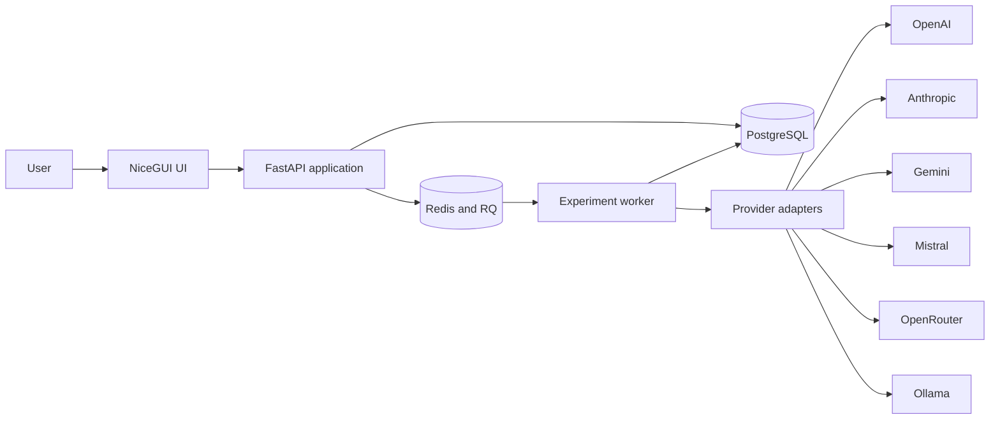
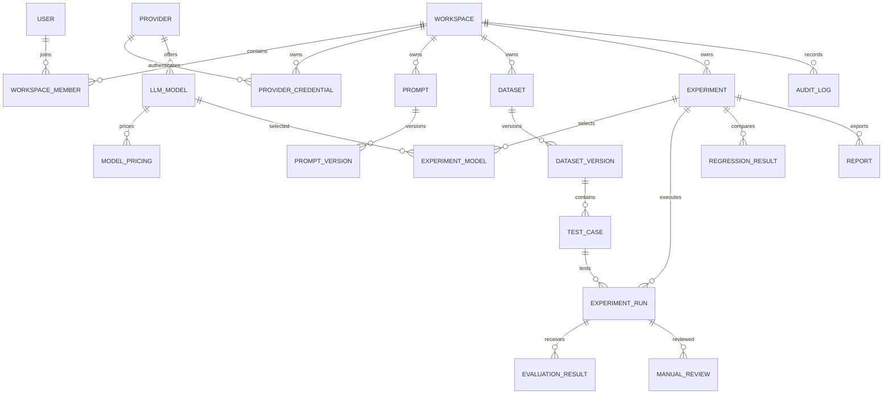
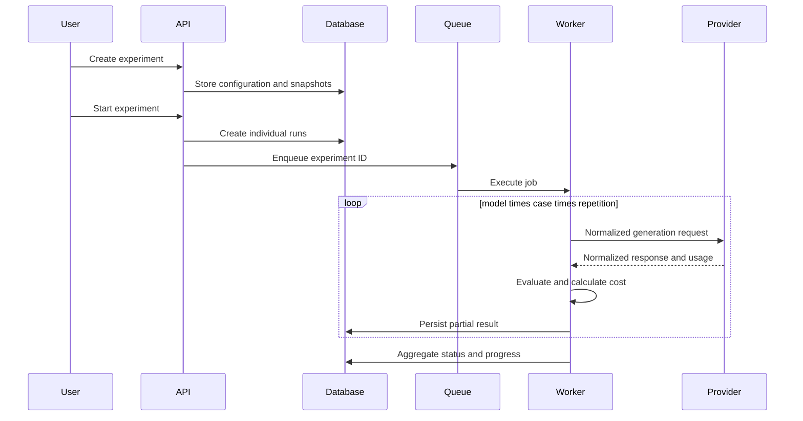

# EvalForge architecture

## System context

EvalForge is a local first SaaS style application. FastAPI exposes the application API, NiceGUI provides the interactive interface, PostgreSQL stores durable state, Redis and RQ isolate costly experiment work from the web process, and provider adapters communicate with external model APIs.

## Layers and responsibilities

The UI layer only coordinates user interactions. API routes validate transport data and enforce workspace roles. Services implement encryption, model synchronization, experiment execution, evaluation, pricing, regression detection, recommendations, imports, and report generation. Provider adapters normalize external APIs behind `BaseModelProvider`. SQLAlchemy entities preserve immutable prompt, dataset, pricing, and execution snapshots.

## Data model

Every primary key is a UUID. Timestamps are stored in UTC. Workspace IDs and compound indexes enforce the most common ownership and filtering paths.

## Experiment flow

Concurrency is bounded per experiment. Retry uses exponential backoff only for normalized retryable errors. The worker checks cancellation and the stored maximum budget. An in flight request may finish after cancellation, but no new request starts after the cancelled state is observed.

## Cost calculation

Input and output prices are stored per million tokens. Cached input has its own optional price. Each `ExperimentModel` and `ExperimentRun` receives a pricing snapshot, so later pricing changes never rewrite historical results. Manual USD and EUR conversion rates are configured with a documented source date outside the application.

## Evaluation

Deterministic evaluators implement exact match, JSON parsing, JSON Schema validation, and required keywords. Semantic similarity accepts an injected embedding function, preventing a hidden dependency on one embedding provider. The registry is designed for LLM judge and source grounding adapters. Automated judge output must be labelled and should never be the only release criterion.

## Security decisions

Provider keys are encrypted with Fernet and masked in the interface. The encryption key and session secret come from environment variables. Passwords use Argon2 through `pwdlib`. Signed tokens expire, every API resource is scoped to a workspace, roles are checked before writes, SQLAlchemy parameterizes database access, imported files have a size limit, template rendering does not evaluate code, and audit data is recursively redacted.

## Queue and failure behavior

The web container and worker container use the same image. RQ jobs store only the experiment UUID. Provider errors are normalized into authentication, permission, rate limit, timeout, unavailable, invalid request, and unknown categories. Raw tracebacks stay out of user responses. Partial runs remain queryable after worker interruption and a paused experiment can reuse queued or failed runs.

## Architectural decisions

1. Synchronous SQLAlchemy sessions keep repository transactions explicit while provider traffic remains asynchronous.
2. Adapter code uses HTTP directly through `httpx`, avoiding provider SDK lock in and reducing dependency churn.
3. Immutable version and snapshot records make comparisons reproducible.
4. SQLite is supported for lightweight local development and tests. PostgreSQL remains the production target.
5. NiceGUI and FastAPI share one process and route tree, so local setup needs one web port.

